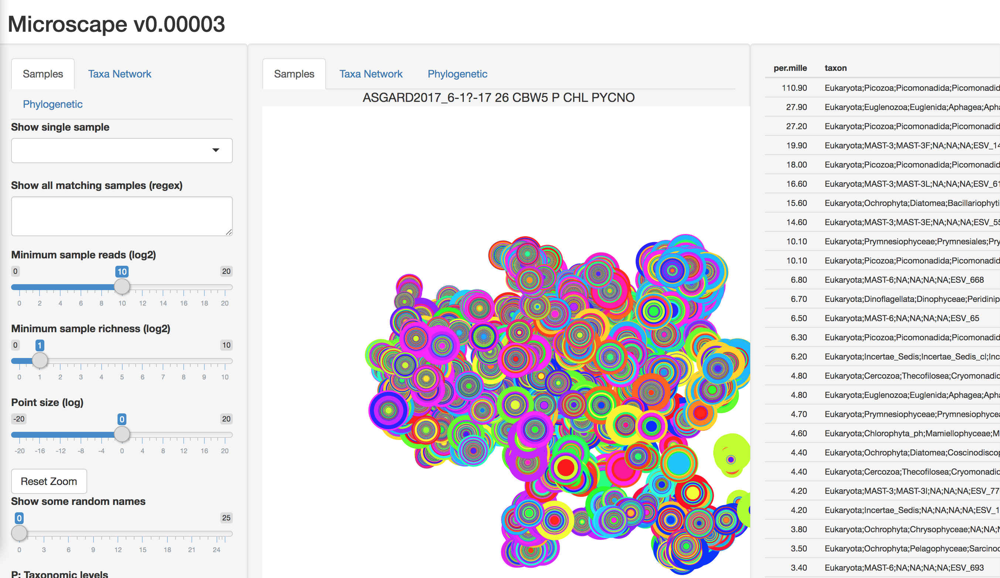
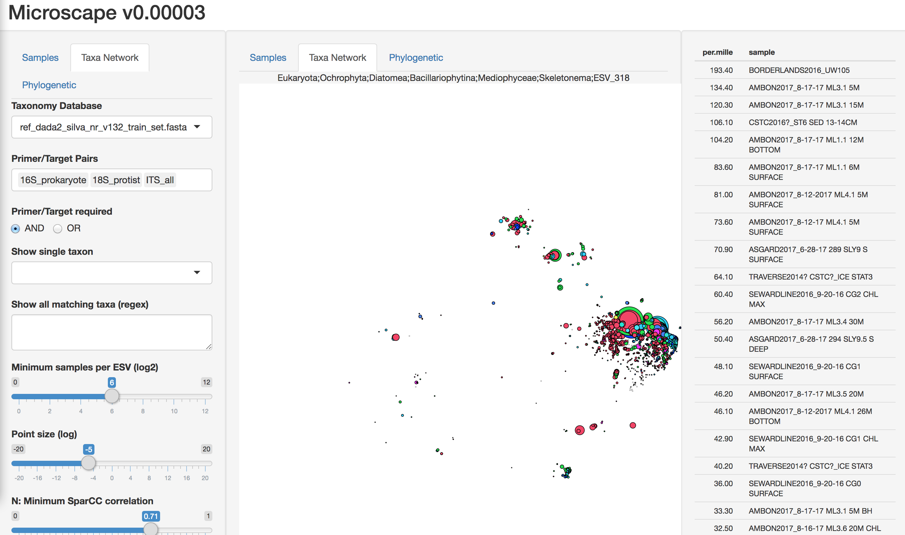
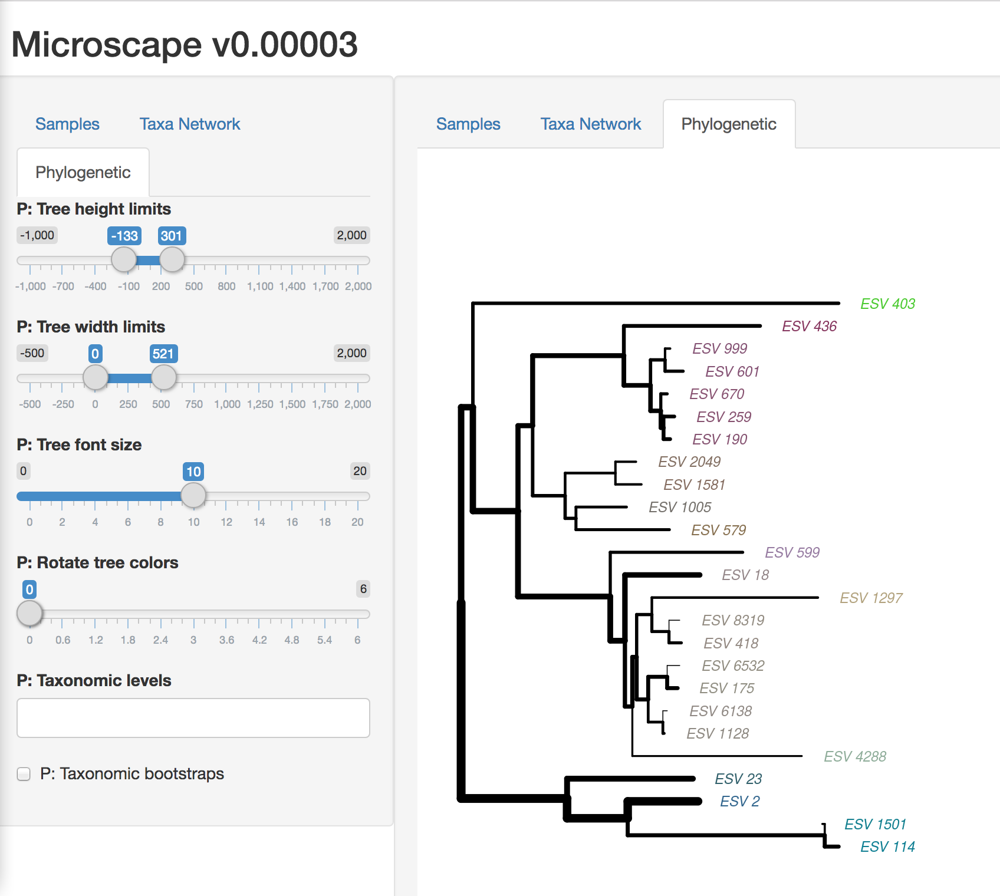

# Microscape: Amplicon Sequencing Analysis Pipeline

Visualizing Microbial Landscapes

Live demo: http://cryomics.org/microscape





## Overview

Microscape is a Nextflow pipeline for amplicon sequencing analysis, from raw
reads to interactive visualization. It uses DADA2 as the core denoising
engine and produces an R Shiny app for exploring microbial communities.

The pipeline takes demultiplexed paired-end FASTQ files and produces:
- **Sequence table**: sample-by-ASV count matrix
- **Taxonomy**: multi-database taxonomic classifications with bootstrap support
- **Normalized tables**: per-group proportional abundances (prokaryote, eukaryote, chloroplast, mitochondria)
- **Phylogeny**: multiple sequence alignment and neighbor-joining tree (optional)
- **Visualizations**: t-SNE ordinations, SparCC networks, interactive Shiny app

## Quick Start

```bash
# Basic run with SILVA taxonomy
nextflow run nextflow/main.nf \
    --input /path/to/reads \
    --ref_databases "silva:/path/to/silva_train_set.fasta:Domain,Phylum,Class,Order,Family,Genus" \
    -resume

# Multiple databases + phylogeny
nextflow run nextflow/main.nf \
    --input /path/to/reads \
    --ref_databases "silva:/db/silva.fasta:Domain,Phylum,Class,Order,Family,Genus;pr2:/db/pr2.fasta:Domain,Supergroup,Division,Class,Order,Family,Genus,Species" \
    --run_phylogeny \
    --dada_cpus 16 \
    -resume

# With persistent cache (skip completed steps across runs)
nextflow run nextflow/main.nf \
    --input /path/to/reads \
    --ref_databases "silva:/db/silva.fasta:Domain,Phylum,Class,Order,Family,Genus" \
    --store_dir /scratch/microscape_cache \
    -resume
```

Run `nextflow run nextflow/main.nf --help` for all options.

## Pipeline Stages

### Stage A: Preprocessing and DADA2

| Step | Process | Description |
|------|---------|-------------|
| 1 | `DEMULTIPLEX` | Optional inner-barcode demultiplexing (Mr_Demuxy) |
| 2 | `REMOVE_PRIMERS` | Primer trimming with cutadapt (auto-selects by 16S/18S/ITS prefix) |
| 3 | `DADA2_FILTER_TRIM` | Per-sample quality filtering (maxEE, truncQ, PhiX removal) |
| 4 | `DADA2_LEARN_ERRORS` | Per-plate error model learning (plates share PCR history) |
| 5 | `DADA2_DENOISE` | Denoising, pair merging, per-plate chimera removal |
| 6 | `MERGE_SEQTABS` | Merge per-plate tables (long-format, memory-efficient) |
| 7 | `REMOVE_CHIMERAS` | Sparse consensus chimera removal on merged data |
| 8 | `FILTER_SEQTAB` | Length, prevalence, abundance, and depth filtering |

### Stage B: Taxonomy and Normalization

| Step | Process | Description |
|------|---------|-------------|
| 9 | `ASSIGN_TAXONOMY` | Naive Bayesian classification (one task per ref DB, parallel) |
| 10 | `BUILD_PHYLOGENY` | DECIPHER alignment + NJ tree (optional, `--run_phylogeny`) |
| 11 | `RENORMALIZE` | Group ASVs by taxonomy and normalize within groups |

### Stage C: Visualization (coming soon)

| Step | Process | Description |
|------|---------|-------------|
| 12 | `LOAD_METADATA` | Sample metadata integration |
| 13 | `CLUSTER_TSNE` | t-SNE ordination of samples and ASVs |
| 14 | `NETWORK_ANALYSIS` | SparCC correlation networks |
| 15 | `BUILD_SHINY` | Interactive Shiny app |

## Parameters

### Input/Output
| Parameter | Default | Description |
|-----------|---------|-------------|
| `--input` | required | Directory of paired-end `*.fastq.gz` files |
| `--outdir` | `results` | Output directory |
| `--store_dir` | off | Persistent cache (skip completed steps across runs) |

### Primer Removal
| Parameter | Default | Description |
|-----------|---------|-------------|
| `--primer_auto` | `true` | Auto-select primer file by filename prefix |
| `--primers` | auto | Override with a specific primer FASTA |
| `--primer_error_rate` | `0.12` | Cutadapt max error rate |

### DADA2
| Parameter | Default | Description |
|-----------|---------|-------------|
| `--maxEE` | `2` | Max expected errors per read |
| `--truncQ` | `11` | Truncate at first base with quality <= Q |
| `--maxN` | `0` | Max Ns allowed |
| `--truncLen_fwd` | `0` | Truncate forward reads at position N (0 = off) |
| `--truncLen_rev` | `0` | Truncate reverse reads at position N (0 = off) |
| `--min_overlap` | `10` | Min overlap for pair merging |

### QC Filtering
| Parameter | Default | Description |
|-----------|---------|-------------|
| `--min_seq_length` | `50` | Remove ASVs shorter than N bp |
| `--min_samples` | `2` | Remove ASVs in fewer than N samples |
| `--min_seqs` | `3` | Remove ASVs with fewer than N total reads |
| `--min_reads` | `100` | Remove samples with fewer than N reads |

### Taxonomy
| Parameter | Default | Description |
|-----------|---------|-------------|
| `--ref_databases` | none | Ref DBs (`"name:path:Levels;..."`) |
| `--run_phylogeny` | `false` | Build phylogenetic tree |

### Resources
| Parameter | Default | Description |
|-----------|---------|-------------|
| `--threads` | `8` | General thread count |
| `--dada_cpus` | `8` | CPUs for DADA2 processes |
| `--dada_memory` | `16 GB` | Memory for DADA2 processes |

## Architecture

```
nextflow/
├── main.nf              # Workflow orchestration
├── nextflow.config      # Parameters, profiles, resources
├── modules/             # Nextflow process definitions
│   ├── dada2.nf         #   DADA2_FILTER_TRIM, LEARN_ERRORS, DENOISE
│   ├── demultiplex.nf   #   DEMULTIPLEX
│   ├── merge.nf         #   MERGE_SEQTABS, REMOVE_CHIMERAS, FILTER_SEQTAB
│   ├── primers.nf       #   REMOVE_PRIMERS
│   ├── phylogeny.nf     #   BUILD_PHYLOGENY
│   ├── renormalize.nf   #   RENORMALIZE
│   └── taxonomy.nf      #   ASSIGN_TAXONOMY
├── bin/                 # Standalone R scripts (runnable outside Nextflow)
│   ├── dada2_filter_trim.R
│   ├── dada2_learn_errors.R
│   ├── dada2_denoise.R
│   ├── merge_seqtabs.R
│   ├── remove_chimeras.R
│   ├── filter_seqtab.R
│   ├── assign_taxonomy.R
│   ├── build_phylogeny.R
│   └── renormalize.R
├── envs/                # Conda environment specs
│   ├── cutadapt.yml
│   ├── dada2.yml
│   ├── demux.yml
│   └── phylo.yml
└── primers/             # Primer FASTA files
    ├── primers-all.fa
    ├── primers-bac.fa
    ├── primers-euk.fa
    └── primers-its.fa
```

## Data Format

The pipeline uses **long-format data.table** as its canonical representation
from the merge step onward:

```
sample          sequence            count
plate1_A01      TACGGAGGATGCGA...   1523
plate1_A01      TACGGAGGATCCGA...   847
plate1_A02      TACGGAGGATGCGA...   2041
```

This avoids the memory cost of materializing a sparse dense matrix (samples x
ASVs). For large datasets (4K+ samples, 100K+ ASVs), the dense matrix can
exceed available memory while the long format uses only the non-zero entries.

A wide-format matrix (`seqtab_final_wide.rds`) is also produced by the filter
step for tools that require it.

### Sparse Chimera Removal

The chimera removal step (`remove_chimeras.R`) includes a reimplementation of
dada2's `removeBimeraDenovo(method="consensus")` that operates on long-format
data. It reuses dada2's C-level `isBimera()` for alignment but avoids the
dense matrix, with per-ASV checks parallelized via `mclapply`.

## Profiles

```bash
-profile standard   # Local execution (default)
-profile test       # Reduced resources for testing
-profile slurm      # Submit to SLURM cluster
```

## Dependencies

- [Nextflow](https://nextflow.io/) >= 23.04.0
- [Conda](https://docs.conda.io/) / [Mamba](https://mamba.readthedocs.io/) (environments created automatically)
- R packages: dada2, ShortRead, data.table, ape, DECIPHER, Biostrings
- [cutadapt](https://cutadapt.readthedocs.io/) for primer removal

## Credits

This pipeline uses [DADA2](https://benjjneb.github.io/dada2/) as the core
denoising engine (Callahan et al. 2016).
